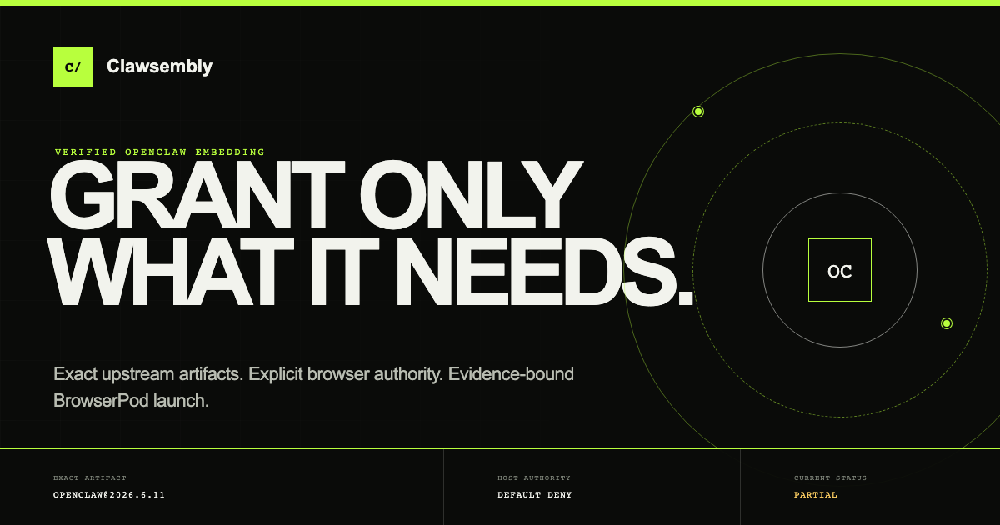

# Clawsembly

> Run upstream coding agents browser-locally, behind a host boundary the
> embedding application controls. Evidence-gated; OpenClaw is the first
> supported upstream.

[](https://github.com/haya-inc/clawsembly/actions/workflows/ci.yml)
[](https://github.com/haya-inc/clawsembly/actions/workflows/compatibility.yml)
[](https://github.com/haya-inc/clawsembly/actions/workflows/runtime-browser.yml)
[](https://haya-inc.github.io/clawsembly/#compatibility)
[](LICENSE)

[](https://haya-inc.github.io/clawsembly/)

日本語: [README.ja.md](README.ja.md)

Clawsembly is an evidence-gated embedding layer that runs upstream coding
agents browser-locally, behind a host boundary the embedding application
controls. [OpenClaw](https://github.com/openclaw/openclaw) is the first
supported upstream: Clawsembly binds the exact published package to public
compatibility evidence and refuses to launch it until that evidence verifies.
Today every tracked release is **probing** — meaning the exact artifact has
been statically inspected, but no owner-authorized runtime evidence exists
yet, so verified launch stays blocked. Clawsembly is an experimental,
single-maintainer project and is not affiliated with or endorsed by the
OpenClaw project.

## What works today, what is blocked

| Item | Status | Notes |
| --- | --- | --- |
| Zero-install promotion-policy check | **Works** | `node examples/release-policy/check.mjs --observe` prints the current promotion decision in a few seconds, no dependencies. |
| Hosted project page | **Works** | [Live reports plus a permission-prompt demo](https://haya-inc.github.io/clawsembly/) against an inert local broker: approve, deny, revoke, export a payload-free audit. |
| npm alpha package | **Published now** | `npm install @haya-inc/clawsembly@alpha` — the reviewed [publication record](packages/compatibility/npm-publication.json) records `status: published` with SHA-512 integrity and Sigstore provenance. |
| Evidence-gated boot demo | **Works** | The [SDK host example](examples/sdk-host/README.md) verifies the pinned report and shows `Provider boot blocked`. Refusing an unverified report is the security feature, working. |
| Boundary chain on real BrowserPod | **Works** | The hello-agent reference binding's full chain — exact-digest staging, dual readiness, capability-mediated chat with denied and allowed outcomes, in-flight abort, cooperative guest stop — has one owner-authorized record on `browserpod@2.12.1` ([evidence](packages/hello-agent-binding/evidence/hello-agent-0.2.0.json), [capture host](examples/hello-agent-evidence-host/capture.mjs)). A reference binding, not a real agent; OpenClaw boot stays blocked below. |
| Verified BrowserPod boot | **Blocked** | Current stable `openclaw@2026.7.1-2` declares the compound engines range `>=22.22.3 <23 \|\| >=24.15.0 <25 \|\| >=25.9.0`, which the exact-form baseline gate rejects before any token spend (`node_baseline_unsupported`), and BrowserPod 2.12.1 provisions Node 22.15.0 — below every branch of that range; reported to the vendor. The checked-in `openclaw@2026.5.7` report remains the capturable target ([#6](https://github.com/haya-inc/clawsembly/issues/6)). |
| Live provider smoke test | **Blocked** | The gated path exists but has never been executed. |
| Performance baselines | **Blocked** | Not yet measured ([#8](https://github.com/haya-inc/clawsembly/issues/8)). |

## Try it

Three steps, no API key required:

1. **Watch the promotion gate decide** (plain Node 22.19+, no install):

   ```bash
   git clone https://github.com/haya-inc/clawsembly
   cd clawsembly
   node examples/release-policy/check.mjs --observe
   ```

2. **Open the hosted project page** at
   <https://haya-inc.github.io/clawsembly/>. It tracks the npm `latest`,
   previous stable, and `beta` OpenClaw channels and runs the reusable
   permission-prompt component against an inert local broker — no runtime
   boots, no host capability is invoked.

3. **Install the published alpha and see evidence-gated boot refuse:**

   ```bash
   npm install @haya-inc/clawsembly@alpha
   ```

   Then follow the [copy-ready SDK host starter](examples/sdk-host/README.md)
   or open the [deployed copy](https://haya-inc.github.io/clawsembly/sdk-host/).
   It fetches the exact HTTPS compatibility report, verifies its pinned
   SHA-256 plus artifact and runtime identity, and must show
   `Provider boot blocked` without calling BrowserPod while the report
   remains `probing`.

## Runtime and cost disclosure

Clawsembly's committed browser-local runtime is
[BrowserPod](https://browserpod.io/docs/overview), which is proprietary and
metered. Every downstream deployment needs its own BrowserPod API key; the
free tier is limited to non-commercial use with attribution, and a BrowserPod
OSS grant program exists for open-source projects. Clawsembly never spends
runtime tokens on an unverified release: `bootVerifiedEmbed` blocks before
token consumption while evidence is missing. See the
[deployment requirements](docs/deployment.md) and
[ADR 0002](docs/decisions/0002-commercial-browser-runtime.md) for the full
licensing analysis.

## Deep dive: product boundary

BrowserPod supplies browser-local Node execution. Clawsembly supplies the
parts an embedding application still needs in order to trust an upstream
agent — implemented today against upstream OpenClaw, the first bound
upstream, and designed to stay upstream-portable
([ADR 0004](docs/decisions/0004-upstream-portable-embedding-boundary.md)):

- exact-version compatibility reports and reproducible failure fixtures;
- a default-deny capability broker for secrets, identity, storage, provider
  traffic, notifications, and future host APIs;
- an evidence-bound embed manifest that rejects runtime-provider mismatch;
- the generated Gateway client and narrow compatibility adapters.

Clawsembly does not reimplement the agent loop and it is not a generic
wrapper around a browser sandbox.

The implemented broker supports exact scopes, call limits, expiry, revocation,
cancellation, bounded metadata-only audit, and redacted handler errors. The
protected provider smoke-test path now crosses that broker. The embed-manifest
core and `bootVerifiedEmbed` select BrowserPod but correctly block verified
launch before token consumption while no owner-authorized BrowserPod runtime
evidence exists. The BrowserPod adapter implements documented Node 22 boot,
`storageKey` persistence, long-running output readiness, HTTPS portal discovery,
and bounded file I/O. A typed filesystem mailbox now connects the untrusted
guest to the exact-scope broker with replay defense, byte limits, generic
errors, cancellation, and payload-free audit. Verified boot automatically
stages and reads back a generated SHA-256-pinned Node client in the fresh
channel, while a release check rejects generated-source drift. Manifest
capabilities remain pending until an explicit, expiring user approval; deny,
revoke, expiry, current state, and combined broker audit are implemented with
stable JSON schemas. The readiness
harness installs the exact SHA-512 npm artifact and requires Gateway log,
portal, `/healthz`, `/readyz`, and a nonce-bound guest-supervisor shutdown. No
owner-authorized BrowserPod record has been captured yet. Its public 2.12.1 API
has no documented terminal-input, provider-termination, or hard-disposal
method, so those features remain explicitly unsupported. See
[ADR 0003](docs/decisions/0003-verified-openclaw-embedding.md) and the
[embedding contract](docs/embedding.md). The capture and attachment procedure
is documented in [BrowserPod evidence](docs/browserpod-evidence.md).
The transport boundary is documented in
[Capability mailbox](docs/capability-mailbox.md), and the authority lifecycle
in [Capability permissions](docs/capability-permissions.md).

The first generated Gateway-client slice is also implemented. A reproducible
contract pins protocol 4 and hashed upstream declarations to the same exact npm
integrity. The SDK configures an exact browser-origin allowlist, persists a
non-extractable Ed25519 identity, signs `connect.challenge`, sends the ephemeral
token only in the connect frame, and validates a token-free `hello-ok` summary.
Mock contract tests cover pairing-required and secret-redaction paths; this is
not yet real BrowserPod handshake evidence.
The same client now exposes only bounded `chat.send`, `chat.history`, and
`chat.abort` operations after authentication. It forces `deliver:false`,
validates stream events, reports sequence gaps without payloads, rejects pending
work on disconnect, and supports an explicit freshly signed reconnect. It does
not expose arbitrary Gateway methods. The embedded pairing bridge re-reads the
current OpenClaw pending list, refuses changed or broader access, and executes
only a one-shot exact-request approve/reject after owner review. Issued device
tokens are encrypted in an artifact/device/role/scope-bound IndexedDB vault and
used for signed reconnect; rejected stale tokens are cleared without entering
results or audit. These paths are provider-free contract evidence, not a claim
that BrowserPod pairing has been run.

The source-level ESM entrypoint now exports the same boot functions declared by
its `.d.mts` contract, and an exact runtime export-surface test prevents typed
consumer examples from failing only after deployment.

## Deep dive: browser runtime direction

Browser-local execution is a product invariant; a remote sandbox is not the
replacement path. [BrowserPod](https://browserpod.io/docs/overview) is the only
active embedded provider in the application, public compatibility target, and
normal CI path. It is not called supported until it reproduces the full Gateway,
broker, tool, recovery, cancellation, persistence, performance, and licensing
evidence in
[ADR 0002](docs/decisions/0002-commercial-browser-runtime.md).
[container2wasm](https://github.com/container2wasm/container2wasm) is retained
as an archived feasibility result after its measured boot failure.

## Deep dive: current evidence

The evidence-gate machinery is generic trust infrastructure; the OpenClaw
reports below are its first instance. The first implementation is a static
compatibility inspector and a public, report-driven project page. For the
pinned `openclaw@2026.7.1-2` artifact it
records package integrity, Node requirements, artifact size, lifecycle scripts,
and platform-specific dependency risks without executing install scripts.
The same page tracks the npm `latest`, previous stable, and `beta` channels as
separate reports. At the 2026-07-21 snapshot those resolve to `2026.7.1-2`,
`2026.6.11`, and `2026.7.2-beta.3`. All three public reports now target
`browserpod@2.12.1`, contain zero runtime evidence, and remain `probing`. A
scheduled workflow skips unchanged channels and opens or updates a generated
report pull request when a channel moves. Each report retains its exact direct
dependency specs; the release index and project page expose added, removed, and
changed preview dependencies against stable. Added and changed packages are
then fetched by their shrinkwrap-resolved version, verified against SHA-512,
and scanned without lifecycle execution for install scripts, native/Wasm
artifacts, Node built-ins, network signals, and browser-authority risk. These
remain static review signals and never promote a runtime check.

The same exact tarballs are inspected for their public Gateway declaration,
runtime entrypoint, protocol constants, server-method inventory, and legacy
plugin declaration distribution. The release index publishes a stable-relative
contract diff with exact added/removed method and schema names. At this
snapshot the stable artifact itself ships the new `dist/gateway/protocol`
declaration distribution: protocol 4 remains current and the legacy
plugin-declaration tree is gone (38 declarations in `2026.6.x`, 0 now), which
is why the generated SDK contract is resolved through that distribution.
Relative to stable, the previous release `2026.6.11` is classified `breaking`
(its public surface lacks 51 schema exports), and preview `2026.7.2-beta.3` is
classified `breaking` with 237 added and 8 removed schema exports. These are
static upgrade warnings, not a claim that those methods run successfully in
BrowserPod.

The main branch is BrowserPod-only: it contains no legacy runtime adapter,
dependency, fixture, evidence record, report target, fallback, or vendor CSP
permission. Browser-host vault, identity, budget, and consent checks remain
provider-free and do not boot a guest runtime or contact OpenAI. The superseded
implementation remains available through Git history and its decision record,
not as executable code in the current tree.

The project page also runs the reusable permission-prompt component against an
inert local broker. Reviewers can approve, deny, revoke, and export a
schema-valid payload-free audit without booting BrowserPod or invoking a host
capability.

Verified embed sessions now expose one manifest-bound OpenClaw installer shared
with the evidence probe. It aggregates concurrent calls and returns executable
paths only after the installed package version and package-lock SHA-512 match
the verified report.

The same session now owns a verified Gateway controller shared with the
evidence probe. It performs supervised launch, HTTPS portal and log readiness,
guest-local health/readiness checks, exact origin configuration, authenticated
protocol-client creation, and cooperative stop without serializing the
ephemeral token.

The page provides a credential-and-explicit-consent gate for one fixed-prompt
`gpt-5.6-luna` live smoke test. It enforces `store:false`, 128 maximum output
tokens, a displayed $0.001 upper bound based on the
[official API pricing](https://developers.openai.com/api/docs/pricing#text-tokens),
cancel control, and completed plain-text output only. Live network execution
has not been performed. Remote approval, token rotation and revocation, general
workspace recovery, and the broader BrowserPod matrix remain experimental, so
the release is reported as `probing` rather than production-compatible.

- [Project page](https://haya-inc.github.io/clawsembly/)
- [Checked-in compatibility report](apps/web/public/data/compatibility.json)
- [Release-channel history](apps/web/public/data/release-history.json)
- [Promotion policy](https://haya-inc.github.io/clawsembly/data/promotion-policy.json)
- [SDK alpha release manifest](https://haya-inc.github.io/clawsembly/downloads/sdk-release.json)
- [SDK source prerelease](https://github.com/haya-inc/clawsembly/releases/tag/v0.1.0-alpha.3)
- [npm publication record](packages/compatibility/npm-publication.json)
- [Report schema](packages/compatibility/report.schema.json)
- [Release-history schema](packages/compatibility/release-history.schema.json)
- [Downstream consumption guide](docs/consuming-reports.md)
- [SDK prerelease recipe](packages/sdk-package/README.md)
- [Copy-ready SDK host starter](examples/sdk-host/README.md)
- [Owner-authorized BrowserPod evidence workflow](docs/browserpod-evidence.md)
- [Maintainer release checklist](docs/releasing.md)
- [Deployment requirements](docs/deployment.md)
- [Support](SUPPORT.md)
- [Governance](GOVERNANCE.md)
- [Welcome discussion](https://github.com/haya-inc/clawsembly/discussions/17)
- [Show and tell](https://github.com/haya-inc/clawsembly/discussions/18)

## Try it in depth

The promotion-policy check from step 1 above is a dependency-free consumer
that fetches the public policy over strict HTTPS and prints the exact preview
decision. Remove `--observe` to make `HOLD` fail CI. See the
[release-policy example](examples/release-policy/README.md) and its copyable
[zero-install GitHub Action](actions/promotion-policy/README.md). The current
preview is intentionally held; this command is useful before verified
BrowserPod support exists.

Requirements for working in the repository: Node.js 22.19 or newer.

```bash
npm install
npm run check
npm run dev
```

The npm alpha installs the same reproducible bytes that were checked into the
release. The exact tarball is also available from Pages and from the GitHub
prerelease:

```bash
npm install @haya-inc/clawsembly@alpha
npm install https://haya-inc.github.io/clawsembly/downloads/haya-inc-clawsembly-0.1.0-alpha.3.tgz
npm install https://github.com/haya-inc/clawsembly/releases/download/v0.1.0-alpha.3/haya-inc-clawsembly-0.1.0-alpha.3.tgz
```

The [GitHub source prerelease](https://github.com/haya-inc/clawsembly/releases/tag/v0.1.0-alpha.3)
carries provider-free browser diagnostics and a provenance record binding the
tag, source commit, Pages manifest, and compatibility report. Runtime support
remains `probing` independently of package distribution.

`npm run sdk:example` installs the tarball into an independent Vite/TypeScript
package without workspace aliases and serves a launch inspector on
`http://127.0.0.1:5174/`. The deployed copy is available at the
[SDK host example](https://haya-inc.github.io/clawsembly/sdk-host/).

Generate a fresh static report for an exact upstream release:

```bash
npm run compat:inspect -- \
  --package openclaw \
  --version 2026.6.11 \
  --runtime browserpod \
  --runtime-version 2.12.1 \
  --browser-baseline "Desktop Chromium" \
  --output apps/web/public/data/compatibility.json
```

The inspector downloads and reads the npm tarball in a temporary directory. It
does not install the package or execute lifecycle scripts.

Resolve and inspect the current stable, previous stable, and preview channels:

```bash
npm run compat:track -- \
  --runtime browserpod \
  --runtime-version 2.12.1
```

Runtime evidence is attached only when its embedded OpenClaw version exactly
matches the inspected artifact. `--skip-unchanged` leaves every generated file
untouched when all three resolved channels are unchanged.

## Maintainer release plumbing

The compatibility-lab root intentionally remains a private npm package. A
separate publish recipe assembles only the canonical SDK/runtime/broker sources
into an installable prerelease artifact:

```bash
npm run sdk:check
npm run sdk:lock
npm run sdk:pack
npm run sdk:example
npm run report-pin:check
```

`sdk:check` creates the tarball twice and requires byte-identical SHA-256
digests, installs it into an isolated temporary consumer, imports every public
ESM subpath, and compiles a strict TypeScript consumer. `sdk:lock` deliberately
updates the copy-ready starter URL and SHA-512 when the SDK version changes;
normal checks reject silent drift. `sdk:pack` writes
`@haya-inc/clawsembly@0.1.0-alpha.3` plus its checksum under ignored
`.artifacts/sdk/`. The matching GitHub prerelease triggered provenance-backed
npm publication under the `alpha` dist-tag; the reviewed
[npm publication record](packages/compatibility/npm-publication.json) now
records `status: published` with matching SHA-512 integrity and Sigstore
provenance.

The [release manifest](https://haya-inc.github.io/clawsembly/downloads/sdk-release.json)
is the source of truth for package distribution. It binds the tarball SHA-256
to the exact public compatibility report and admits the npm install path only
because the reviewed publication record supplies matching SHA-512 integrity
and Sigstore provenance. Runtime support remains independently recorded as
`status:probing`.

The six-hour release tracker regenerates the host pin from the exact stable
report in its read-only job and carries both through one validated artifact to
the separate PR-publishing job. Pin changes therefore remain explicit review
diffs without becoming a handwritten release step.

To regenerate and byte-check the Gateway contract against the exact published
npm artifact:

```bash
npm run protocol:generate
npm run protocol:verify
```

The browser lane requires Playwright Chromium and verifies the public page,
BrowserPod-only runtime presentation, deployment policy, and provider-free
security surfaces:

```bash
npx playwright install chromium
npm run test:browser
```

Maintainers can capture the first real BrowserPod readiness record through the
manual, Environment-protected `Browser host, page, and evidence` workflow. It
is opt-in, metered, installs the exact provider SDK from an isolated lock, and
uploads evidence for review without committing or promoting it automatically.

## Goals

- Run upstream coding agents rather than maintaining an independent agent
  rewrite. OpenClaw is the first bound upstream; additional upstreams bind
  through the documented
  [upstream-binding contract](docs/upstream-binding-contract.md), whose
  hello-agent reference binding — test-scoped, and since 2026-07-21 backed by
  one owner-authorized real-BrowserPod record — demonstrates that the boundary
  is upstream-portable and extends an agent through embedder-granted host
  capabilities
  ([ADR 0005](docs/decisions/0005-reference-agent-growth-paths.md)). No
  second real agent runs today.
- Keep the host boundary — default-deny capability broker, evidence-bound
  embed manifest, permission prompts, and payload-free audit — embedder-
  controlled and upstream-portable, as the reusable product across upstreams.
- Make each bound upstream safe to embed through exact artifact identity,
  evidence-bound launch, and explicit browser-host authority.
- Keep the useful default browser-local, with an optional native Gateway
  interoperability mode rather than a remote-sandbox dependency.
- Expose browser limitations as explicit capabilities instead of silently
  emulating unavailable host features.
- Detect and validate upstream releases automatically, as supporting trust
  infrastructure rather than the product itself.
- Keep local data and execution inside browser security boundaries where
  possible.

## Documentation

- [Documentation index](docs/README.md)
- [Project vision](docs/vision.md)
- [Prior-art survey](docs/prior-art.md)
- [Proposed architecture](docs/architecture.md)
- [Upstream compatibility strategy](docs/upstream-compatibility.md)
- [Initial roadmap](docs/roadmap.md)
- [Product and adoption strategy](docs/product.md)
- [OSS success strategy](docs/oss-strategy.md)
- [Risk register](docs/risk-register.md)
- [Security model](docs/security-model.md)
- [Commercial browser runtime decision](docs/decisions/0002-commercial-browser-runtime.md)
- [Verified OpenClaw embedding decision](docs/decisions/0003-verified-openclaw-embedding.md)
- [Upstream-portable embedding boundary decision](docs/decisions/0004-upstream-portable-embedding-boundary.md)
- [Reference-agent growth paths decision](docs/decisions/0005-reference-agent-growth-paths.md)
- [Verified embedding contract](docs/embedding.md)
- [Upstream binding contract](docs/upstream-binding-contract.md)

## Contributing

Compatibility work is most useful when it is small and reproducible. Good first
contributions include dependency classifications, browser failure fixtures,
report-schema improvements, and capability-specific adapters. See
[CONTRIBUTING.md](CONTRIBUTING.md) before opening a pull request. Security issues
must follow [SECURITY.md](SECURITY.md).

## Status

The first end-to-end compatibility slice is implemented and reproducible from
the project page. It is a probe, not a production runtime: the credential vault
and OpenClaw broker turn prove the complete secret boundary with mock transport,
and a protected fixed-prompt live smoke path is enabled behind credential and
explicit-consent gates. No live provider request has been executed in the
checked-in evidence yet.
Backup/export controls currently apply only to the deterministic mock-state
snapshot and deliberately exclude credentials. Browser-owned device signing,
exact pending-request review, explicit pairing controls, encrypted token
retention, and token reconnect pass provider-free contract tests. They are not
yet backed by an owner-authorized BrowserPod/Gateway record. Remote-mode
approval, rotation, revocation, and recovery remain future work.
The embedding boundary itself now has its first owner-authorized record on the
real provider: the hello-agent reference chain — verified staging, readiness,
capability-mediated chat with denied and allowed outcomes, in-flight abort,
and cooperative stop — executed on `browserpod@2.12.1` in a real browser, with
the digest-bound evidence checked in under
[`packages/hello-agent-binding/evidence/`](packages/hello-agent-binding/evidence/hello-agent-0.2.0.json).
That record proves the boundary machinery, not any real upstream: OpenClaw
runtime support remains `probing` and blocked on the vendor gaps above.

## License

[MIT](LICENSE)
