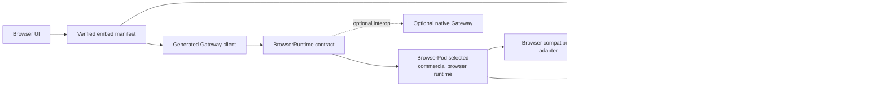

# Proposed architecture

This architecture preserves browser-local execution while making the product a
verified embedding layer rather than a runtime wrapper. BrowserPod is the
only embedded provider in the main branch. Superseded provider code and evidence
are available through Git history, not through a current runtime branch.
See [ADR 0002](decisions/0002-commercial-browser-runtime.md) and
[ADR 0003](decisions/0003-verified-openclaw-embedding.md).

## System overview

## Runtime modes

### Embedded mode

The browser boots a runtime provider, installs or mounts a pinned upstream
OpenClaw package, applies a versioned compatibility manifest, and starts a
constrained Gateway. Execution and workspace state remain in the browser tab.
BrowserPod is the selected embedded provider. It is not supported until it
earns the acceptance evidence defined by ADR 0002. container2wasm is retained
only as an archived feasibility record after its measured boot failure.

Expected initial capabilities:

- browser chat and streamed model responses;
- provider HTTP calls through an audited host bridge where necessary;
- a workspace stored in the guest and persisted through IndexedDB or OPFS;
- JavaScript or Wasm-based constrained tool execution;
- Gateway health, session, and chat operations.

Expected initial exclusions:

- native addons and native subprocess binaries;
- host browser control through Playwright/CDP;
- mDNS, raw TCP/UDP listeners, and LAN discovery;
- messaging integrations requiring unsupported native libraries;
- reliable background execution after the browser runtime is terminated.

### Optional remote mode

The UI may connect to an ordinary native OpenClaw Gateway over its documented
WebSocket protocol for interoperability. It is not the default and cannot be
used to satisfy browser-runtime acceptance gates.

Both modes should expose the same UI-facing client interface. Feature discovery
determines which actions are shown or enabled.

## Components

### Application shell

Owns onboarding, runtime selection, status, terminal and log surfaces, and
browser permission prompts. It must not contain OpenClaw agent logic.

### Generated Gateway client

Generated from the upstream Gateway schema and wrapped by a small handwritten
transport layer. The implemented handshake slice:

- pins the exact npm artifact, protocol 4, accepted client identity, and hashes
  of the upstream declaration sources;
- waits for `connect.challenge` and signs the v3 payload with a persistent,
  non-extractable browser Ed25519 key;
- sends shared or stored device auth only in the authenticated connect frame;
- validates the exact-version `hello-ok` and returns method/event discovery
  plus advertised limits without returning issued bearer tokens;
- caps pre-authentication frames and emits payload-free audit metadata;
- admits only generated chat send/history/abort RPCs after authentication,
  forces local-only delivery, validates stream events, and bounds payloads,
  pending requests, history, cancellation, and sequence-gap diagnostics;
- rejects pending RPCs on disconnect and allows an explicit fresh signed
  handshake with the same persistent identity;
- reviews exact pending pairing state before a one-shot local approve/reject,
  encrypts issued device tokens, and uses them for explicit signed reconnect;
- exposes the declared boot helpers from the same ESM entrypoint and tests the
  exact runtime export surface as a consumer would import it;
- avoids depending on private OpenClaw workspace packages at runtime.

Broader RPC generation, automatic reconnect/backoff, token
rotation/revocation/recovery, attachments, and forward-compatible unknown
post-authentication events remain to be generated.

OpenClaw documents its Gateway protocol and TypeBox code-generation pipeline in
[Gateway protocol](https://docs.openclaw.ai/gateway/protocol) and
[TypeBox](https://docs.openclaw.ai/concepts/typebox).

### Browser runtime manager

Boots and tears down a selected browser runtime, mounts workspace files,
installs the pinned OpenClaw artifact, launches the Gateway, captures
diagnostics, and publishes runtime capabilities. Provider-specific behavior
must stay behind a contract covering process execution, terminal I/O, file
operations, local service discovery, persistence, cancellation, and teardown.

The first BrowserPod preflight is intentionally dependency-injected. It checks
the exact Node 22.19+ baseline, `node:crypto`, and `node:sqlite` without loading
proprietary runtime code or transmitting a metered API key until the caller
explicitly opts in. The archived container2wasm lane retains its pinned Node
22.19 amd64 conversion, size, boot failure, and license evidence separately.

The BrowserPod lifecycle adapter now starts long-running processes without
awaiting their completion, captures bounded terminal output, waits for exact
readiness text and HTTPS portals, uses `storageKey` persistence, and closes
every filesystem handle. BrowserPod 2.12.1 documents no terminal input,
process termination, or Pod disposal, so the contract exposes those features
as false and refuses to claim complete teardown.

The provider-free page and browser-host suite currently declares desktop
Chromium as its first browser baseline. Firefox and WebKit belong to a separate
BrowserPod provider matrix after owner-authorized runtime evidence is
available. TypeScript remains at ES2023 as the conservative web/public-API
output floor even though the guest runtime itself requires Node 22.19 or newer.

The BrowserPod evidence runner composes that contract without adding a second
provider-specific control path. It verifies Node/crypto/SQLite, performs the
exact npm install, matches the installed lock integrity, starts the real
Gateway, and gathers log, portal, `/healthz`, and `/readyz` evidence. Raw
records are schema-validated and only promote matching runtime-version,
browser, and artifact checks; they do not imply protocol or broker support.

Clawsembly-launched long-running commands may use a guest-local cooperative
supervisor. A nonce-bound stop file requests `SIGTERM`, followed by `SIGKILL`
after a grace period, without persisting process environment values. This
closes the Gateway task used by the evidence probe, but does not imply provider
process termination or Pod hard disposal.

### Compatibility adapter

Contains browser-specific behavior that upstream OpenClaw does not provide.
The adapter is configured by a versioned manifest rather than scattered
version checks.

Responsibilities include:

- dependency and loader overrides;
- environment and configuration normalization;
- browser-host device-signature bridging;
- network and storage host bridges;
- unsupported-capability errors;
- structured startup and health diagnostics.

### Browser host

Runs outside the guest runtime and owns privileged browser APIs. Candidate
interfaces include:

- `identity.generate`;
- `storage.snapshot`, `storage.restore`, and `storage.persist`;
- `http.fetch` with destination and credential policy;
- `notify` and browser permission mediation;
- future WIT-based Wasm capability invocation.

Every interface should be narrow, typed, cancellable, and auditable.

BrowserPod guest calls cross this boundary through a filesystem mailbox. The
host writes the exact broker subject and byte limits into a per-boot channel;
the guest writes monotonic request slots and cancellation markers. The host
strictly parses bounded envelopes, rejects replay, invokes only its in-memory
broker, and returns generic bounded responses. Mailbox metadata is discovery,
never authority. See [BrowserPod capability mailbox](capability-mailbox.md).

The canonical Node guest client and protocol are compiled into a deterministic
host artifact with per-file and combined SHA-256 identifiers. Verified boot
checks the source digests, stages both modules inside the fresh channel, reads
them back byte-for-byte, and returns only explicit paths and non-secret command
environment. CI rejects any generated artifact that drifts from canonical
source.

### Capability broker

The broker is the product security boundary between the untrusted guest and
browser-host authority. A session is bound to an exact OpenClaw version and
integrity. Requests require an exact capability and scope grant; unknown,
expired, revoked, or exhausted grants fail closed.

The implemented broker consumes call limits before asynchronous dispatch,
propagates cancellation, redacts handler failures, and stores only bounded
audit metadata. Payloads and results never enter the audit trail. See
[Verified embedding contract](embedding.md).

Embed-manifest capability rows enter a consent controller as pending requests,
not grants. Only an exact user approval can create a broker grant, its call
limit cannot exceed the request, and it expires within 24 hours. Deny, revoke,
and expiry decisions use fixed reason codes. Current permission state and the
combined permission/broker audit have stable JSON schemas. See
[Capability permission lifecycle](capability-permissions.md).

### Embed manifest

The embed manifest combines artifact identity, compatibility evidence,
BrowserPod selection, and capability grants. Verified launch remains blocked
while the checked-in BrowserPod report has a status below `supported`. Evidence
from any other provider is rejected. This prevents a provider decision from
becoming an unsupported compatibility claim.

The active implementation follows the same boundary in code:
`browserpod-runtime.mjs` owns the documented provider API,
`browserpod-openclaw-probe.mjs` owns exact-artifact readiness evidence,
`boot.mjs` owns verified launch, and the capability-mailbox modules own guest
transport. The project page and compatibility packages contain only BrowserPod
runtime contracts.

`permission-prompt.mjs` is the framework-neutral host UI for exact permission
decisions. It derives DOM from the controller manifest, keeps authority in the
controller rather than data attributes, allows only bounded duration/call
inputs, refreshes on grant expiry, and exports the same schema-governed audit
used by headless integrations.

`openclaw-installer.mjs` is shared by evidence probes and verified embed
sessions. It accepts only an exact semver plus SHA-512 identity, writes a
minimal dependency manifest, runs npm with an explicit secret-free environment,
and verifies the installed manifest and lock entry before exposing the OpenClaw
executable. Concurrent calls share one install and successful calls are
idempotent.

`openclaw-gateway.mjs` is likewise shared by evidence probes and verified embed
sessions. It calls the verified installer, launches the exact executable behind
the guest supervisor, requires both log/portal readiness and guest-local
`/healthz` plus `/readyz`, and clears its ephemeral token on stop. Ready records
and audit events exclude the token; only an explicit trusted-host
`connection()` call returns it. Before launch it configures an exact
`gateway.controlUi.allowedOrigins` allowlist through the installed OpenClaw CLI;
wildcards, path-bearing values, and public plaintext HTTP origins fail closed.

`gateway-device-identity.mjs` keeps a non-extractable Ed25519 private key in
IndexedDB and exposes only a descriptor and challenge-signing operation.
`gateway-client.mjs` consumes `connection()` inside the host closure, performs
the protocol 4 handshake, and serializes neither the shared token nor an issued
device token into results or audit. `gateway-device-token-vault.mjs` stores an
issued role token as AES-GCM ciphertext under a non-extractable IndexedDB key;
artifact integrity, device id, role, and scopes are authenticated data. The
client prefers that device token for a later explicitly requested handshake and
clears it on an authenticated token-mismatch response.

The Gateway controller owns a narrow local pairing-management bridge. It runs
only `openclaw devices list|approve|reject --json` from the exact installed
artifact and state directory. Review compares the current pending device,
single generated role, and exact generated scopes before issuing an opaque,
five-minute, one-use review id. Approval or rejection repeats that comparison
immediately before the decision command. The browser client never receives a
generic pairing RPC or permission to approve itself. The DOM prompt consumes
only the redacted review and invokes the two exact controller actions.

The embed session lifecycle prevents logical runtime disposal from racing the
Gateway. `close()` stops the supervised child first and retains runtime access
when stop fails; synchronous `dispose()` refuses while the Gateway is active.

## Persistence

The first implementation should separate:

- structured application metadata in IndexedDB;
- workspace files and runtime snapshots in OPFS;
- secrets as non-extractable Web Crypto keys and encrypted IndexedDB records;
- exportable user backups in an explicit, versioned format.

BrowserPod workspace migration fixtures, encryption, and workspace-scale
recovery remain required before a production backup contract exists.

The browser host now has a separate credential-vault slice. It stores a
non-extractable AES-GCM key and provider-scoped ciphertext in IndexedDB and
never exposes those records to a guest runtime. The active provider policy
enforces the official Responses endpoint, stateless storage, rejected
redirects, bounded JSON, user-configurable request/input/output budgets, and
secret-safe errors. BrowserPod must invoke that policy through the typed
capability mailbox.

The project page also exposes a protected live smoke-test surface. It is locked
unless an `openai` credential exists in the browser vault and the user checks a
billable-request disclosure. The request contains one fixed probe prompt, sets
`store:false` and `max_output_tokens:128`, and can be cancelled. No workspace,
chat, tool-result, device-token, or backup content is accepted by this path.
Partial output is never rendered; only a completed, validated response is
inserted with `textContent`. The cost preview uses a conservative byte-based
input estimate, the official `gpt-5.6-luna` standard token rates, and a regional
uplift margin, rounded upward to $0.001. Automated tests arm the gate but assert
that no live endpoint request occurs.

Device identity is owned by a second IndexedDB database. The browser creates a
non-extractable Ed25519 private key, derives the OpenClaw-compatible device ID
from the raw public key, and signs the exact v3 challenge payload. The page
proves persistence, non-extractability, signing, nonce rejection, pairing-prompt
shape, and encrypted token-vault round trip without a guest runtime. The token
vault is separate from both device identity and provider credentials, so an
export or corruption in one store does not silently change another trust
record. BrowserPod pairing and token reconnect remain pending provider evidence.

Clearing site data can remove all browser-owned state, so users need a visible
backup and restore path before Clawsembly is considered production-ready.

## Security boundaries

- Treat model output, workspace code, plugins, and downloaded packages as
  untrusted.
- Do not expose general host filesystem access in embedded mode.
- Do not persist plaintext provider secrets into workspace files.
- Generate a unique device identity for each installation; never ship a shared
  private key.
- Deny unsupported or unclassified host calls by default.
- Record network, process, file, and capability decisions in a bounded audit
  stream with secret redaction.
- Make the browser sandbox an additional boundary, not the only security
  control.

## Open design questions

- Which current native dependencies are imported eagerly during minimal boot?
- How should remote approval, device-token rotation, revocation, and recovery
  be surfaced without expanding the bridge process authority?
- Should workspace persistence use file-level synchronization or runtime
  snapshots?
- Which host interfaces should become WIT components first?
- What browser and mobile support baseline is practical for BrowserPod?
