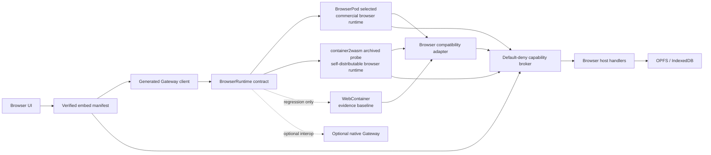

# Proposed architecture

This architecture preserves browser-local execution while making the product a
verified embedding layer rather than a runtime wrapper. BrowserPod is the
adopted provider; the current WebContainer probe remains a measured baseline.
See [ADR 0002](decisions/0002-commercial-browser-runtime.md) and
[ADR 0003](decisions/0003-verified-openclaw-embedding.md).

## System overview

## Runtime modes

### Embedded mode

The browser boots a runtime provider, installs or mounts a pinned upstream
OpenClaw package, applies a versioned compatibility manifest, and starts a
constrained Gateway. Execution and workspace state remain in the browser tab.
BrowserPod is the selected embedded provider. It is not supported until it
earns the acceptance evidence defined by ADR 0002. container2wasm is retained
only as an archived feasibility record after its measured boot failure.

Expected initial capabilities:

- browser chat and streamed model responses;
- provider HTTP calls through an audited host bridge where necessary;
- a workspace stored in the guest and persisted through IndexedDB or OPFS;
- JavaScript or Wasm-based constrained tool execution;
- Gateway health, session, and chat operations.

Expected initial exclusions:

- native addons and native subprocess binaries;
- host browser control through Playwright/CDP;
- mDNS, raw TCP/UDP listeners, and LAN discovery;
- messaging integrations requiring unsupported native libraries;
- reliable background execution after the browser runtime is terminated.

### Optional remote mode

The UI may connect to an ordinary native OpenClaw Gateway over its documented
WebSocket protocol for interoperability. It is not the default and cannot be
used to satisfy browser-runtime acceptance gates.

Both modes should expose the same UI-facing client interface. Feature discovery
determines which actions are shown or enabled.

## Components

### Application shell

Owns onboarding, runtime selection, status, terminal and log surfaces, and
browser permission prompts. It must not contain OpenClaw agent logic.

### Generated Gateway client

Generated from the upstream Gateway schema and wrapped by a small handwritten
transport layer. It should:

- negotiate the supported protocol range;
- honor limits advertised by `hello-ok`;
- discover supported methods and events;
- preserve unknown event or frame payloads for forward compatibility;
- avoid depending on private OpenClaw workspace packages at runtime.

OpenClaw documents its Gateway protocol and TypeBox code-generation pipeline in
[Gateway protocol](https://docs.openclaw.ai/gateway/protocol) and
[TypeBox](https://docs.openclaw.ai/concepts/typebox).

### Browser runtime manager

Boots and tears down a selected browser runtime, mounts workspace files,
installs the pinned OpenClaw artifact, launches the Gateway, captures
diagnostics, and publishes runtime capabilities. Provider-specific behavior
must stay behind a contract covering process execution, terminal I/O, file
operations, local service discovery, persistence, cancellation, and teardown.

The first BrowserPod preflight is intentionally dependency-injected. It checks
the exact Node 22.19+ baseline, `node:crypto`, and `node:sqlite` without loading
proprietary runtime code or transmitting a metered API key until the caller
explicitly opts in. The archived container2wasm lane retains its pinned Node
22.19 amd64 conversion, size, boot failure, and license evidence separately.

The BrowserPod lifecycle adapter now starts long-running processes without
awaiting their completion, captures bounded terminal output, waits for exact
readiness text and HTTPS portals, uses `storageKey` persistence, and closes
every filesystem handle. BrowserPod 2.12.1 documents no terminal input,
process termination, or Pod disposal, so the contract exposes those features
as false and refuses to claim complete teardown.

The BrowserPod evidence runner composes that contract without adding a second
provider-specific control path. It verifies Node/crypto/SQLite, performs the
exact npm install, matches the installed lock integrity, starts the real
Gateway, and gathers log, portal, `/healthz`, and `/readyz` evidence. Raw
records are schema-validated and only promote matching runtime-version,
browser, and artifact checks; they do not imply protocol or broker support.

### Compatibility adapter

Contains browser-specific behavior that upstream OpenClaw does not provide.
The adapter is configured by a versioned manifest rather than scattered
version checks.

Responsibilities include:

- dependency and loader overrides;
- environment and configuration normalization;
- browser-host device-signature bridging;
- network and storage host bridges;
- unsupported-capability errors;
- structured startup and health diagnostics.

### Browser host

Runs outside the guest runtime and owns privileged browser APIs. Candidate
interfaces include:

- `identity.generate`;
- `storage.snapshot`, `storage.restore`, and `storage.persist`;
- `http.fetch` with destination and credential policy;
- `notify` and browser permission mediation;
- future WIT-based Wasm capability invocation.

Every interface should be narrow, typed, cancellable, and auditable.

### Capability broker

The broker is the product security boundary between the untrusted guest and
browser-host authority. A session is bound to an exact OpenClaw version and
integrity. Requests require an exact capability and scope grant; unknown,
expired, revoked, or exhausted grants fail closed.

The implemented broker consumes call limits before asynchronous dispatch,
propagates cancellation, redacts handler failures, and stores only bounded
audit metadata. Payloads and results never enter the audit trail. See
[Verified embedding contract](embedding.md).

### Embed manifest

The embed manifest combines artifact identity, compatibility evidence,
BrowserPod selection, and capability grants. Verified launch remains blocked
while the checked-in report targets WebContainer or has a status below
`supported`. This prevents a commercial-provider decision from becoming an
unsupported compatibility claim.

The current evidence implementation follows the same boundary in code:
`runtime-probe.ts` owns page state and the legacy WebContainer preflight UI,
`runtime-gateway-probe.ts` owns the Gateway, provider bridge, lifecycle, and
recovery orchestration, and `runtime-probe-support.ts` owns reusable process,
device-signing, and transcript-verification helpers. Provider policy,
credential storage, and state persistence remain separate modules.

## Persistence

The first implementation should separate:

- structured application metadata in IndexedDB;
- workspace files and runtime snapshots in OPFS;
- secrets as non-extractable Web Crypto keys and encrypted IndexedDB records;
- exportable user backups in an explicit, versioned format.

The current compatibility probe exports mock OpenClaw state as a WebContainer
binary snapshot and wraps it in a v1 manifest with the OpenClaw version, scope,
length, and SHA-256 digest. It writes that envelope to OPFS, boots a fresh
runtime, validates and mounts the payload, and verifies transcript contents.
The user-facing format still needs workspace migration fixtures, encryption,
and workspace-scale recovery before it is a production backup contract.

The browser host now has a separate credential-vault slice. It stores a
non-extractable AES-GCM key and provider-scoped ciphertext in IndexedDB and
never mounts those records into WebContainer. This proves the at-rest boundary;
provider requests traverse a fixed-destination host broker. Its mock transport
probe enforces the official Responses endpoint, stateless storage, rejected
redirects, bounded JSON, and secret-safe errors. A bounded loopback provider
translates OpenClaw's local Chat Completions request into a browser-host message;
the host ignores the WebContainer model alias, selects `gpt-5.6-luna`, calls the
Responses policy, parses typed SSE text and function-call events, and forwards
only validated deltas or calls. The loopback side converts a function call into
Chat Completions `tool_calls`; OpenClaw executes the allowlisted `agents_list`
tool, returns its result, and the host converts the matched call/result history
into Responses `function_call` and `function_call_output` input items before a
second broker request. Historical results are not mistaken for a continuation
after a newer user message. For cancellation,
the Gateway probe sends `chat.abort` and an explicit adapter control message;
the browser aborts the matching provider controller and the Responses body is
cancelled. The explicit control message is required because WebContainer's HTTP
compatibility layer does not surface client fetch abort as a server-side close
event. The probe uses mock fetch at the exact external boundary, so the
continuation payload is verified but live requests remain disabled.

The loopback provider accepts only `broker-v1`, validates an ephemeral bridge
capability, caps body and input size, and has a four-request budget. These are
defense-in-depth controls rather than a tenant boundary because workspace code
can read the local OpenClaw configuration. Provider credentials remain solely
in the browser-host vault. A second browser-host budget is user-configurable
before startup and counts requests, serialized Responses input characters, and
streamed text/function-argument characters across the session. Exceeding any
dimension rejects the request and cancels an active provider body.

The project page also exposes a protected live smoke-test surface. It is locked
unless an `openai` credential exists in the browser vault and the user checks a
billable-request disclosure. The request contains one fixed probe prompt, sets
`store:false` and `max_output_tokens:128`, and can be cancelled. No workspace,
chat, tool-result, device-token, or backup content is accepted by this path.
Partial output is never rendered; only a completed, validated response is
inserted with `textContent`. The cost preview uses a conservative byte-based
input estimate, the official `gpt-5.6-luna` standard token rates, and a regional
uplift margin, rounded upward to $0.001. Automated tests arm the gate but assert
that no live endpoint request occurs.

Device identity is owned by a second IndexedDB database. The browser creates a
non-extractable Ed25519 private key, derives the OpenClaw-compatible device ID
from the raw public key, and signs the exact v3 challenge payload. A loopback
probe process passes only the challenge and signed public device record across
the boundary; it never receives the private key. WebContainer's `node:crypto`
cannot construct the current verifier key, so the pinned 2026.6.11 artifact uses
an exact-marker, fail-closed source patch that falls back to Noble Ed25519
verification. Upstream marker drift aborts installation instead of weakening
verification.

The local Control UI probe then follows OpenClaw's ordinary
`openclaw-control-ui` / `webchat` policy. OpenClaw silently approves this
loopback-local device, issues a device token, and accepts a second signed
connection authenticated only with that token. The browser host encrypts the
token with the credential-vault AES key and retains it across document reload.
Because WebContainer cannot expose its loopback socket directly to the page,
the token exists briefly in a dedicated bridge process; it is never mounted,
persisted in the workspace, or copied into diagnostics.

Clearing site data can remove all browser-owned state, so users need a visible
backup and restore path before Clawsembly is considered production-ready.

## Security boundaries

- Treat model output, workspace code, plugins, and downloaded packages as
  untrusted.
- Do not expose general host filesystem access in embedded mode.
- Do not persist plaintext provider secrets into workspace files.
- Generate a unique device identity for each installation; never ship a shared
  private key.
- Deny unsupported or unclassified host calls by default.
- Record network, process, file, and capability decisions in a bounded audit
  stream with secret redaction.
- Make the browser sandbox an additional boundary, not the only security
  control.

## Open design questions

- Can the Noble verifier fallback be replaced by an upstream WebContainer-safe
  verification path?
- Which current native dependencies are imported eagerly during minimal boot?
- How should remote approval, device-token rotation, revocation, and recovery
  be surfaced without expanding the bridge process authority?
- Should workspace persistence use file-level synchronization or runtime
  snapshots?
- Which host interfaces should become WIT components first?
- What browser and mobile support baseline is practical for WebContainers?
