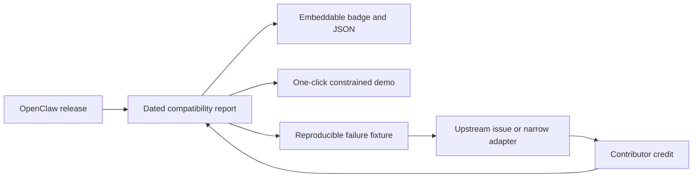

# OSS success strategy

Survey date: 2026-07-12.

## Evaluation

The documentation is unusually strong on architecture, security boundaries,
and evidence discipline. The main strategic risk is not technical ambiguity;
it is being mistaken for one more browser-native agent product. Clawsembly
should therefore lead with a narrower promise:

> Embed the current upstream OpenClaw in a browser with explicit authority and
> evidence for every compatibility claim.

The project should not compete on the number of providers, tools, channels, or
agent features. Those are upstream OpenClaw's job. Clawsembly's defensible work
is the release-to-evidence pipeline: inspect an exact artifact, boot the real
runtime, exercise the documented protocol, publish failures, and keep the
result current.

## Market evidence

The projects in the [prior-art survey](prior-art.md) validate four different
forms of demand:

| Project | 2026-07-12 signal | What users appear to reward | Boundary for Clawsembly |
| --- | ---: | --- | --- |
| [ClawLess](https://github.com/open-gitagent/clawless) | 516 stars / 91 forks | Immediate browser demo, editor, terminal, policy, and audit story | Closest browser-host precedent, but its OpenClaw path is a point-in-time template with broad stubs and a shared identity |
| [OpenBrowserClaw](https://github.com/wexare-ai/openbrowserclaw) | 597 stars / 83 forks | A one-sentence product promise: “the browser is the server” | Independent agent loop; does not inherit OpenClaw behavior |
| [ShadowClaw](https://github.com/xt-ml/shadow-claw) | 2 stars / 0 forks | Deep browser-native implementation alone has not produced distribution | Useful implementation reference, not a validation of upstream compatibility demand |
| [IronClaw](https://github.com/nearai/ironclaw) | 12.4k stars / 1.4k forks | Security-first identity, differentiated architecture, installable releases, and explicit parity tracking | Reimplementation demonstrates both demand and the long-term cost of manual parity |

Star and fork counts are dated observations, not quality rankings. They show
that a crisp story and a usable artifact distribute better than architecture
documents alone. Clawsembly needs both, while keeping its evidence standard.

## The wedge

Clawsembly should own one job before broadening:

1. detect a new stable OpenClaw release;
2. publish a report for the exact npm artifact within six hours;
3. distinguish proven, constrained, failed, and untested behavior;
4. attach a reproduction to every failure;
5. turn recurring failures into a narrow adapter or an upstream report.

The north-star metric is **time to trustworthy compatibility evidence for the
current stable release**. Stars, demo sessions, and page traffic are useful
distribution signals, but they do not replace freshness and reproducibility.

## Distribution loop

The report is the trust surface. The capability broker is the reusable product
surface. The demo proves both are real, and the fixture is the contribution
unit. This is a more sustainable community loop than accepting broad feature
requests.

## 90-day gates

### Gate 1 — credible launch artifact

- Publish the project page, report schema, raw evidence, and reproducible commands.
- Keep the current stable release inspected and clearly label the result
  `probing` until owner-authorized BrowserPod runtime gates pass.
- Capture BrowserPod cold/warm install, persistent reuse, Gateway-ready latency,
  and storage footprint; publish the numbers before optimizing them.
- Report upstream only failures reproduced against the current BrowserPod
  boundary; do not carry removed-runtime patches into the active backlog.

Exit signal: an OpenClaw integrator can reproduce a report without maintainer
help and can identify why a check is not green.

### Gate 2 — reusable compatibility infrastructure

- Generate reports for latest stable, previous stable, and preview.
- Publish a small badge or JSON endpoint that downstream projects can consume.
- Open one issue per classified failure with a minimal fixture and ownership
  boundary.
- Add a release-history view only after at least two real releases have been
  processed; do not build an empty dashboard.

Exit signal: at least one external project links to or consumes the report.

Current implementation: stable / previous / preview resolution, exact-artifact
reports, release-history JSON, project-page comparison, unchanged-channel
suppression, generated-report pull requests, public schemas, and a fail-closed
promotion policy with a dependency-free CI consumer are implemented. External
consumption and multi-release runtime evidence are not yet proven.

### Gate 3 — contributor flywheel

- Label bounded fixture, classification, docs, and adapter issues as good first
  contributions.
- Credit contributors in generated release reports and changelog entries.
- Publish a short screen recording of the exact install → handshake → constrained
  tool turn flow; the video must show the pinned version and evidence status.
- Seek review from OpenClaw integrators and browser-runtime maintainers before
  promoting to general end users.

Exit signal: three non-maintainer contributors land a useful change and one
maintainer can process a new release without handwritten runtime changes.

## Decisions that protect the strategy

- Do not become a second OpenClaw implementation.
- Do not hide unsupported native capabilities behind generic dummy packages.
- Do not claim “runs locally” without disclosing runtime delivery, metering,
  license, and external provider traffic.
- Do not make a live-provider request part of the default or automated demo.
- Do not optimize for a large feature checklist before release freshness,
  reproducibility, and cold-start cost are under control.
- Do not treat stars as a release gate; treat external report consumption and
  non-maintainer contributions as stronger validation.

## Immediate priority order

1. Capture the owner-authorized BrowserPod readiness/Gateway record in
   [issue #6](https://github.com/haya-inc/clawsembly/issues/6).
2. Establish BrowserPod cold/warm/persistent performance baselines in
   [issue #8](https://github.com/haya-inc/clawsembly/issues/8).
3. Offer the install-free promotion-policy consumer as the first adoption path,
   keep the packed-SDK host example reproducible, and seek a genuinely external
   consumer; first-party examples prove usability, not adoption.
4. Keep stable/previous/preview reports automated and preserve the last
   provider-evidenced stable result once one exists.
5. Invite review from OpenClaw integrators and BrowserPod maintainers; add
   broader workspace persistence, remote mode, and capabilities only
   when they improve a measured compatibility gate.
