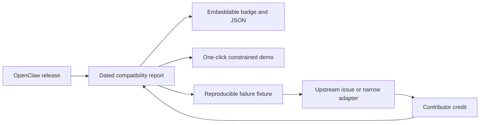

# OSS success strategy

Survey date: 2026-07-12. Status annotations updated: 2026-07-21.

## Evaluation

The documentation is unusually strong on architecture, security boundaries,
and evidence discipline. The main strategic risk is not technical ambiguity;
it is being mistaken for one more browser-native agent product, or being
reduced to an OpenClaw release-tracking service. Clawsembly should therefore
lead with the positioning fixed in
[ADR 0004](decisions/0004-upstream-portable-embedding-boundary.md):

> Clawsembly is an evidence-gated embedding layer that runs upstream coding
> agents browser-locally, behind a host boundary the embedding application
> controls. OpenClaw is the first supported upstream.

The project should not compete on the number of providers, tools, channels, or
agent features. Those are the upstream agent's job. Clawsembly's job is to run
the upstream artifact in the embedder's browser and to give the embedding
application an adjustable, auditable authority boundary, with evidence behind
every compatibility claim.

Honesty constraints apply to every claim derived from this framing: today only
OpenClaw is bound; the boundary chain has one owner-authorized runtime record
on the real provider via the hello-agent reference binding (2026-07-21, PR
[#48](https://github.com/haya-inc/clawsembly/pull/48)), while no OpenClaw
release has owner-authorized runtime evidence, so all published OpenClaw
reports are status `probing`; and multi-upstream is a design commitment whose
next concrete step is a documented upstream-binding contract, not a shipped
capability. No surface may state or imply that other agents already run, and
no surface may present the reference-binding record as agent evidence.

## Market evidence

The projects in the [prior-art survey](prior-art.md) validate four different
forms of demand:

| Project | 2026-07-12 signal | What users appear to reward | Boundary for Clawsembly |
| --- | ---: | --- | --- |
| [ClawLess](https://github.com/open-gitagent/clawless) | 516 stars / 91 forks | Immediate browser demo, editor, terminal, policy, and audit story | Closest browser-host precedent, but its OpenClaw path is a point-in-time template with broad stubs and a shared identity |
| [OpenBrowserClaw](https://github.com/wexare-ai/openbrowserclaw) | 597 stars / 83 forks | A one-sentence product promise: “the browser is the server” | Independent agent loop; does not inherit OpenClaw behavior |
| [ShadowClaw](https://github.com/xt-ml/shadow-claw) | 2 stars / 0 forks | Deep browser-native implementation alone has not produced distribution | Useful implementation reference, not a validation of upstream compatibility demand |
| [IronClaw](https://github.com/nearai/ironclaw) | 12.4k stars / 1.4k forks | Security-first identity, differentiated architecture, installable releases, and explicit parity tracking | Reimplementation demonstrates both demand and the long-term cost of manual parity |

Star and fork counts are dated observations, not quality rankings. They show
that a crisp story and a usable artifact distribute better than architecture
documents alone. None of the surveyed projects offers an embedder-controlled,
evidence-bound host boundary around a real upstream artifact; that gap — not
report tooling — is the position Clawsembly claims. Clawsembly needs the crisp
story and the usable artifact while keeping its evidence standard.

## Defensible value

Two assets compound over time and are hard for a replica to re-earn:

1. **Browser-local runtime integration.** Booting exact upstream artifacts on
   BrowserPod — cold and warm install, workspace persistence, the capability
   mailbox, and readiness signaling — accumulates integration evidence and
   failure knowledge release by release. A from-scratch competitor has to
   re-derive that corpus against the same moving upstream.
2. **The embedder-controlled host boundary.** The default-deny capability
   broker, the evidence-bound embed manifest, the permission-prompt UI, and
   payload-free audit form a boundary the embedding application controls and
   can adjust easily. Per ADR 0004 this boundary is upstream-portable by
   design: none of its components depend on OpenClaw specifics.

The release-tracking pipeline is explicitly **not** the moat. It is
straightforwardly replicable by a well-capitalized upstream or competitor: the
OpenClaw Foundation is OpenAI-backed, and if it ships its own CITGM-style
release pipeline, that work is commoditized overnight. A pipeline-specialist
identity would therefore be a wasting asset. The pipeline remains essential
trust infrastructure — the evidence-gate machinery is generic, and the
OpenClaw reports are its first instance — but it is not the product.

As supporting infrastructure, the pipeline keeps owning one job:

1. detect a new stable OpenClaw release;
2. publish a report for the exact npm artifact within six hours;
3. distinguish proven, constrained, failed, and untested behavior;
4. attach a reproduction to every failure;
5. turn recurring failures into a narrow adapter or an upstream report.

The north-star metric is split into two tiers: **automated-report latency**
(six-hour target, unattended) and **runtime-evidence latency** (72-hour
target, accounting for manual owner-approved capture). The full definition
lives in [docs/product.md](product.md). Stars, demo sessions, and page traffic
are useful distribution signals, but they do not replace freshness and
reproducibility.

## Distribution loop

The report is the trust surface. The host boundary — broker, manifest,
permission UI, and audit — is the reusable product surface that the reports
gate. The demo proves both are real, and the fixture is the contribution unit.
This is a more sustainable community loop than accepting broad feature
requests, and it survives even if an upstream ships its own release pipeline,
because the loop feeds the boundary rather than being the product itself.

## 90-day gates

### Gate 1 — credible launch artifact

- Publish the project page, report schema, raw evidence, and reproducible commands.
- Keep the current stable release inspected and clearly label the result
  `probing` until owner-authorized BrowserPod runtime gates pass.
- Capture BrowserPod cold/warm install, persistent reuse, Gateway-ready latency,
  and storage footprint; publish the numbers before optimizing them.
- Report upstream only failures reproduced against the current BrowserPod
  boundary; do not carry removed-runtime patches into the active backlog.

Status: **partially met as of 2026-07-21** — the boundary chain (verified
staging, default-deny broker, consent lifecycle, in-flight abort, revocation,
payload-free audit, cooperative stop) has one owner-authorized runtime record
on `browserpod@2.12.1` via the hello-agent reference binding
([evidence](../packages/hello-agent-binding/evidence/hello-agent-0.2.0.json),
PR [#48](https://github.com/haya-inc/clawsembly/pull/48)), and the
boundary-chain performance baseline landed 2026-07-21 on that same chain
(cold / warm / persistent-reuse, three samples per pass on
`browserpod@2.12.1`,
[baseline](../packages/hello-agent-binding/evidence/hello-agent-perf-0.2.0.json)):
provider boot medians under 0.9 s and ≈6.2 s cold / ≈4.7 s persistent-reuse
to the first protocol round trip. The OpenClaw-artifact portion of
[#8](https://github.com/haya-inc/clawsembly/issues/8) (npm-install time,
installed bytes, Gateway-ready latency) stays open behind the vendor gaps
([#6](https://github.com/haya-inc/clawsembly/issues/6),
[#47](https://github.com/haya-inc/clawsembly/issues/47)). The
runtime-evidence tier of the north-star
metric still awaits OpenClaw runtime evidence; the automated-report tier is
already operating (see [docs/product.md](product.md) for the two-tier
definition).

Exit signal: an OpenClaw integrator can reproduce a report without maintainer
help and can identify why a check is not green.

### Gate 2 — reusable compatibility infrastructure

- Generate reports for latest stable, previous stable, and preview.
- Publish a small badge or JSON endpoint that downstream projects can consume.
- Open one issue per classified failure with a minimal fixture and ownership
  boundary.
- Add a release-history view only after at least two real releases have been
  processed; do not build an empty dashboard.

Exit signal: at least one external project links to or consumes the report.

Current implementation: stable / previous / preview resolution, exact-artifact
reports, release-history JSON, project-page comparison, unchanged-channel
suppression, generated-report pull requests, public schemas, and a fail-closed
promotion policy with dependency-free Node and GitHub Action consumers are implemented. External
consumption and multi-release runtime evidence are not yet proven.

The byte-reproducible SDK alpha.2 is distributed from Pages, GitHub Releases,
and npm with an exact checksum, compatibility-report binding,
tag/source/report provenance, and provider-free browser diagnostics. The
provenance-backed npm bootstrap is complete: the reviewed publication record
(`packages/compatibility/npm-publication.json`) binds the registry bytes to
the same SHA-512 integrity and Sigstore provenance. npm remains an additional
discovery channel, not a prerequisite for the first external integration and
never a substitute for BrowserPod runtime evidence; no distribution surface
weakens the `probing` gate.
The SDK host example is a copy-ready consumer with an integrity-pinned Release
dependency; the normal SDK gate rebuilds the package and rejects lock drift.

### Gate 3 — contributor flywheel

- Label bounded fixture, classification, docs, and adapter issues as good first
  contributions.
- Credit contributors in generated release reports and changelog entries.
- Publish a short screen recording of the exact install → handshake → constrained
  tool turn flow; the video must show the pinned version and evidence status.
- Seek review from OpenClaw integrators and browser-runtime maintainers before
  promoting to general end users.

Exit signal: three non-maintainer contributors land a useful change and one
maintainer can process a new release without handwritten runtime changes.

## Upstream scenarios

Pre-committed responses to upstream moves, decided now rather than under
deadline pressure:

- **An official OpenClaw browser story ships.** The embedding layer and the
  embedder-controlled boundary retain their value: an official runtime still
  needs a host boundary that the embedding application, not the upstream,
  controls, and evidence gating applies to whatever artifact ships. Response:
  evaluate the official runtime as a candidate bound artifact under the same
  evidence gates, and offer the report pipeline upstream as their release
  input rather than competing with it.
- **A restrictive upstream re-license.** Response: fork-freeze at the last
  MIT-licensed version and decide continuation per the upstream-binding
  contract — keep maintaining the frozen binding, bind a different upstream,
  or both. No forward commitment to track a non-OSS artifact.
- **Gateway protocol closure or obfuscation.** Response: a documented
  threshold — when the protocol contract can no longer be regenerated and
  verified from the published artifact — at which client regeneration for
  that upstream stops. The last verified binding stays frozen and labeled as
  such; the boundary and the upstream-agnostic embedding core remain, because
  they do not depend on that upstream's protocol.

## Decisions that protect the strategy

- Do not become a second OpenClaw implementation.
- Do not let the project identity become OpenClaw-only; OpenClaw is the first
  bound upstream, not the definition of the project.
- Do not present the report pipeline as the product; it is trust
  infrastructure that gates the embedding layer.
- Do not hide unsupported native capabilities behind generic dummy packages.
- Do not claim “runs locally” without disclosing runtime delivery, metering,
  license, and external provider traffic.
- Do not make a live-provider request part of the default or automated demo.
- Do not optimize for a large feature checklist before release freshness,
  reproducibility, and cold-start cost are under control.
- Do not treat stars as a release gate; treat external report consumption and
  non-maintainer contributions as stronger validation.

## Immediate priority order

1. Execute the owner-authorized BrowserPod evidence capture in
   [issue #6](https://github.com/haya-inc/clawsembly/issues/6) and establish
   the cold/warm/persistent performance baselines in
   [issue #8](https://github.com/haya-inc/clawsembly/issues/8). Nothing else
   converts `probing` into evidence. As of 2026-07-13 the capture is blocked
   by the vendor runtime: BrowserPod 2.12.1 provisions Node 22.15.0, below
   the 22.19 baseline, so the readiness probe fails closed with
   `node_baseline_unsatisfied`; the vendor has been notified. Update
   2026-07-21: the OpenClaw capture (#6) remains vendor-blocked — the current
   stable's compound engines range still exceeds the guest Node 22.15.0, and
   the guest lacks the `node:sqlite` binding
   ([#47](https://github.com/haya-inc/clawsembly/issues/47)), both reported —
   but the boundary chain captured its first owner-authorized runtime record
   on the real provider through the hello-agent reference binding (PR
   [#48](https://github.com/haya-inc/clawsembly/pull/48)), so the #8
   performance baselines are now executable independent of the vendor gaps.
2. Apply to the BrowserPod OSS grant program, and keep disclosing plainly that
   every downstream deployment needs its own metered BrowserPod API key and
   that the free tier is non-commercial.
3. File the two static-analysis findings upstream with neutral framing: the
   stable release's shrinkwrap inconsistency and the preview release's
   Gateway-contract break. Report observations and reproductions, not
   judgments.
4. Make one announcement, and only after the runtime evidence and the README
   fixes land. Do not spend the single credible launch on a `probing`-only
   state. Update 2026-07-21: the boundary-chain runtime record and the README
   updates landed with PR
   [#48](https://github.com/haya-inc/clawsembly/pull/48), so the
   soft-announcement condition is met; the general-audience launch (for
   example Show HN) stays reserved for the first OpenClaw verified boot.
5. Manufacture the first external consumer — for example, a pull request to a
   stale-pinned downstream such as ClawLess that consumes the report or
   promotion-policy endpoint. Keep the packed-SDK host example reproducible as
   the copy-ready starting point; first-party examples prove usability, not
   adoption.
6. Publish the documented upstream-binding contract: exact artifact identity,
   boot recipe, protocol client, capability requirements, and evidence gates.
   This is the concrete next step for upstream portability, ahead of any
   second binding.
7. Ship the embedder-DX slice: make the host boundary easy for an embedding
   application to adopt and adjust.
