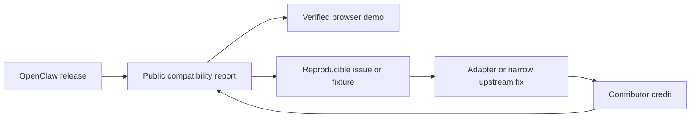

# Product and adoption strategy

Clawsembly is an evidence-gated embedding layer specialized in OpenClaw: it
runs the upstream package browser-locally, behind a host boundary the
embedding application controls, and wraps it with the conveniences its
operators and embedders need (see
[ADR 0004](decisions/0004-upstream-portable-embedding-boundary.md) and
[ADR 0006](decisions/0006-openclaw-specialist-refocus.md)).

## Initial user

The first user is a web application team that wants to embed an upstream
coding agent browser-locally with explicit, adjustable authority. The first
concrete persona is an OpenClaw integrator or maintainer who needs to embed an
exact upstream release safely in a web application and prove what it can do.
The first user is not a non-technical consumer looking for full OpenClaw
parity.

## Five-minute value

A visitor should be able to answer five questions without installing the
project:

1. Which OpenClaw release was inspected?
2. Which claims are proven, constrained, failed, or still pending?
3. How can the result be reproduced or improved?
4. Which host capabilities would the embedded session receive?
5. How does the embedding application adjust those capabilities?

When a release is verified, the same page should offer a one-click constrained
browser-chat demo.

## Public artifacts

- a versioned JSON compatibility report;
- a stable / previous / preview release index with exact evidence levels;
- a derived promotion/rollback policy that downstream CI can consume without
  installing the SDK;
- a human-readable compatibility page and badge;
- failure fixtures containing inputs, logs, and the expected classification;
- a generated Gateway client that external applications can reuse;
- narrow compatibility adapters with explicit capability ownership.
- a verified BrowserPod embed manifest and default-deny capability broker.

## Adoption loop

Generic feature requests are not the upstream strategy. Clawsembly should bring
reproducible evidence and propose the smallest upstream-independent or upstream
fix that preserves OpenClaw's platform boundaries.

## Suggested success metrics

The north-star metric is **time to trustworthy compatibility evidence for the
current stable release of a bound upstream** (today: OpenClaw). It is
published as two tiers:

- **Automated-report latency**: a compatibility report is published within six
  hours of a stable upstream release, fully unattended.
- **Runtime-evidence latency**: owner-authorized runtime evidence is published
  within 72 hours of the same release. The longer window accounts for the
  manual, metered, owner-approved capture step and the maintainer timezone.

A tier counts only when its artifact and reproduction path are public. Both
tiers must be instrumented, not asserted: every report records the upstream
publish timestamp so latency is computable from published artifacts alone, and
external consumption — npm downloads, GitHub dependents, and report fetches —
is tracked as the adoption signal. No owner-authorized runtime evidence exists
yet, so the runtime-evidence tier has no measured baseline; all published
reports are status probing.

The first baseline must be measured before targets are made stricter.

- coverage: latest verified stable, previous verified stable, and latest preview;
- evidence: no green status without boot, handshake, and mocked chat artifacts;
- maintenance: additive protocol updates require no handwritten runtime change;
- reliability: supported-browser success rate and p75 cold/warm boot time are
  published after owner-authorized BrowserPod evidence exists; the historical
  57.1 s cold install, 2.9 s warm reinstall, and 16.4 s Gateway-ready figures
  belong to the removed runtime and are comparison data, not a BrowserPod SLO;
- community: at least three non-maintainer contributors complete a fixture,
  classification, documentation, or adapter contribution before 1.0.

Stars are a distribution signal, not a release gate.

Near-term validation should use stronger signals: one external project consuming
the report or badge, three non-maintainer contributors landing bounded changes,
and one additive upstream release processed without handwritten runtime changes.
See the [OSS success strategy](oss-strategy.md) for the competitive position and
90-day gates.

Current adoption surface: the public policy endpoint, schema, dependency-free
Node consumer, and zero-install GitHub Action are implemented. These surfaces
are the OpenClaw instance of the generic evidence gate — supporting trust
infrastructure, not the product itself. They make external consumption
possible before npm publication; a first independent consumer is still the
next distribution proof.

The reproducible SDK alpha is also directly installable from Pages with a
machine-readable checksum/report binding. This removes registry access as an
adoption prerequisite without relabeling the `probing` runtime as supported.
The matching GitHub prerelease adds a conventional discovery surface, browser
diagnostics, and tag/source/Pages/report provenance for independent review.
The external host example pins that release URL and its SHA-512 in a standalone
lockfile, so copying the directory and running `npm ci` does not depend on the
repository workspace or an unpublished npm package.
