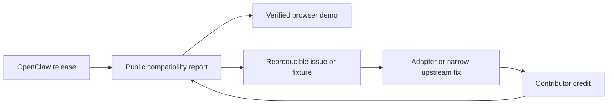

# Product and adoption strategy

## Initial user

The first user is an OpenClaw integrator or maintainer who needs to embed an
exact upstream release safely in a web application and prove what it can do.
The first user is not a non-technical consumer looking for full OpenClaw parity.

## Five-minute value

A visitor should be able to answer four questions without installing the
project:

1. Which OpenClaw release was inspected?
2. Which claims are proven, constrained, failed, or still pending?
3. How can the result be reproduced or improved?
4. Which host capabilities would an embedded session receive?

When a release is verified, the same page should offer a one-click constrained
browser-chat demo.

## Public artifacts

- a versioned JSON compatibility report;
- a stable / previous / preview release index with exact evidence levels;
- a human-readable compatibility page and badge;
- failure fixtures containing inputs, logs, and the expected classification;
- a generated Gateway client that external applications can reuse;
- narrow compatibility adapters with explicit capability ownership.
- a verified BrowserPod embed manifest and default-deny capability broker.

## Adoption loop

Generic feature requests are not the upstream strategy. Clawsembly should bring
reproducible evidence and propose the smallest upstream-independent or upstream
fix that preserves OpenClaw's platform boundaries.

## Suggested success metrics

The north-star metric is **time to trustworthy compatibility evidence for the
current stable OpenClaw release**. A report counts only when its artifact,
runtime evidence, and reproduction path are public.

The first baseline must be measured before targets are made stricter.

- compatibility freshness: report generated within six hours of a stable release;
- coverage: latest verified stable, previous verified stable, and latest preview;
- evidence: no green status without boot, handshake, and mocked chat artifacts;
- maintenance: additive protocol updates require no handwritten runtime change;
- reliability: supported-browser success rate and p75 cold/warm boot time are
  published after owner-authorized BrowserPod evidence exists; the historical
  57.1 s cold install, 2.9 s warm reinstall, and 16.4 s Gateway-ready figures
  belong to the removed runtime and are comparison data, not a BrowserPod SLO;
- community: at least three non-maintainer contributors complete a fixture,
  classification, documentation, or adapter contribution before 1.0.

Stars are a distribution signal, not a release gate.

Near-term validation should use stronger signals: one external project consuming
the report or badge, three non-maintainer contributors landing bounded changes,
and one additive upstream release processed without handwritten runtime changes.
See the [OSS success strategy](oss-strategy.md) for the competitive position and
90-day gates.
